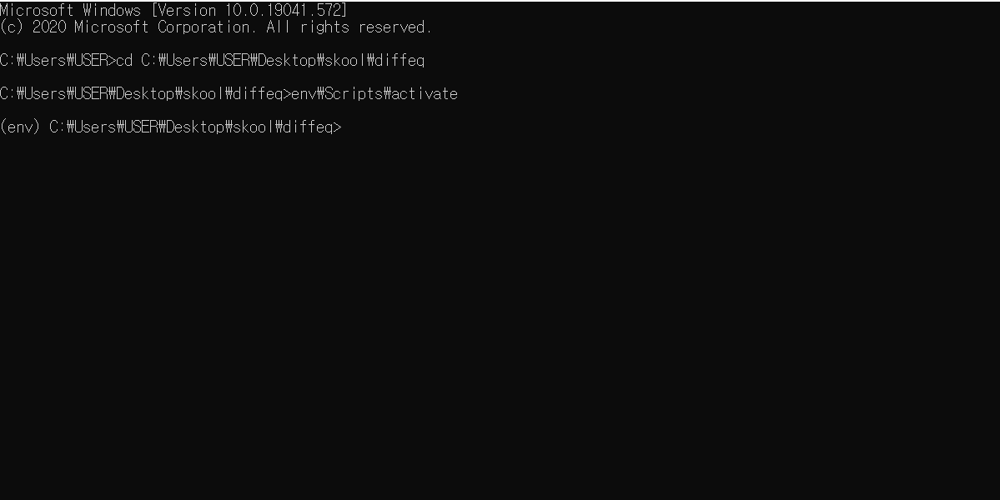
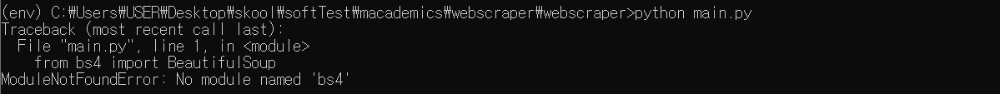
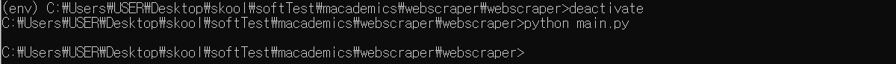
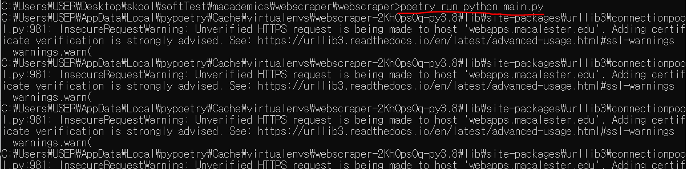
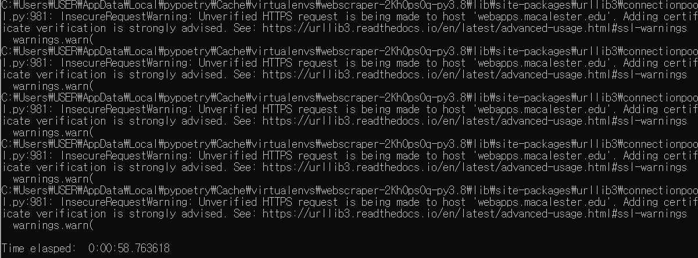
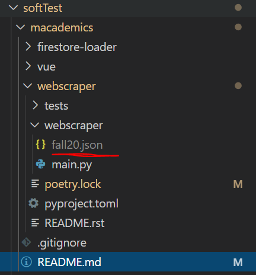

# Running Poetry on Windows CMD and Powershell

This is a demonstration to show that the poetry runs when using the command line `poetry run python main.py` or `poetry run py main.py` on Windows CMD or Powershell.

Before starting, I used `poetry install` inside of the webscraper beforehand and installed the poetry virtual environment inside of the package as instructed in the first page of this repository.

In our first step, we make sure we do not have `beautifulsoup4` packages installed by `pip`. The main virtual environment is installed in a folder called "`diffeq`" here. I activate the virtual environment.

Then we move into the folder where it contains the `main.py`. Run it regularly with `python main.py` or `py main.py`.

We see that it does not run because we do not have `beautifulsoup4` package in the virtual environment that is activated. Now, what about the default setting the virtual environment deactivated?

We deactivate the virtual environment and just run "`python main.py`" raw. We encounter an issue where nothing runs. The `json` output file is not produced, failing to compile in the first place.

At last, run the program with "`poetry run python main.py`". We will finally see some outputs coming out and a resulting `json` file inside of the targeted directory.

The main issue was that the when running program using `python` or `py` command, the first place that the compiler calls is the packages from the virtual environment. By adding `poetry run` in front of `python main.py`, we are telling the computer that we want the program to run inside of the virtual environment provided by `poetry`.